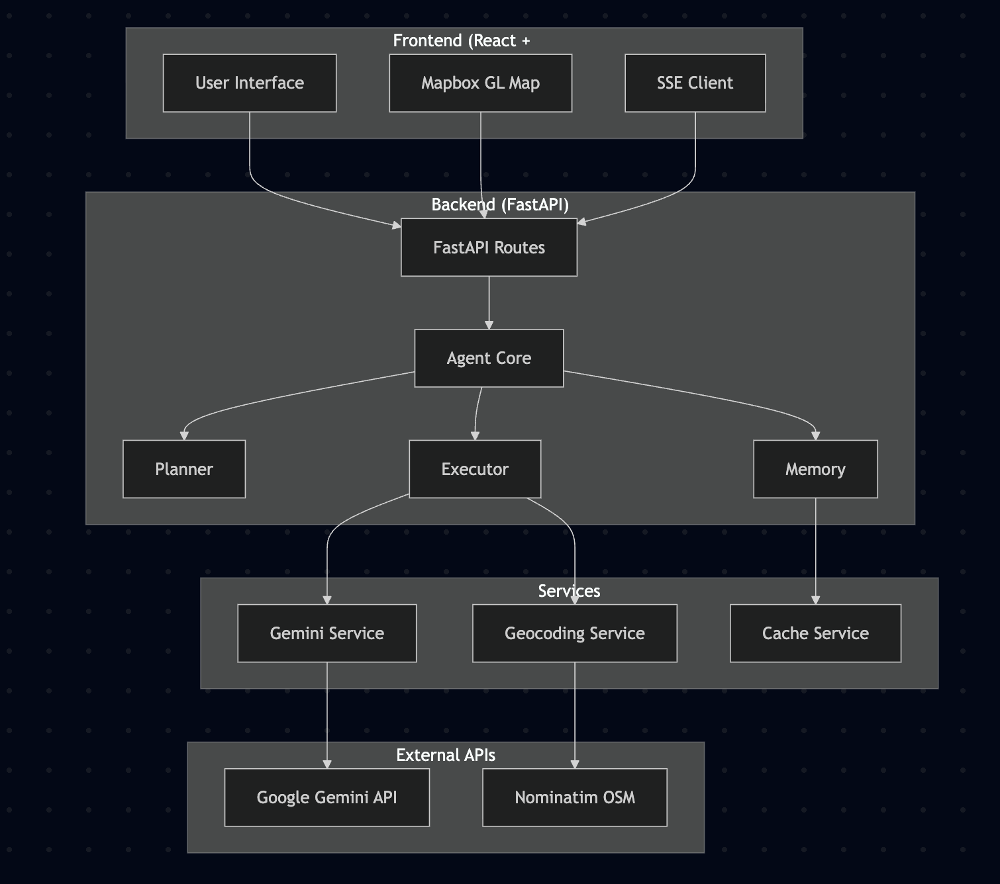
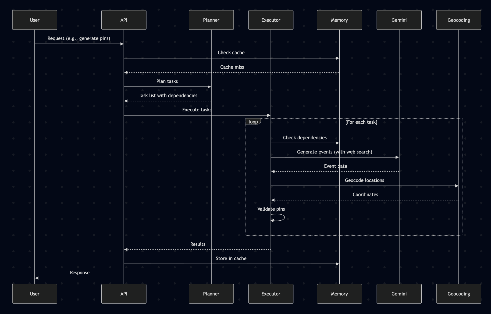
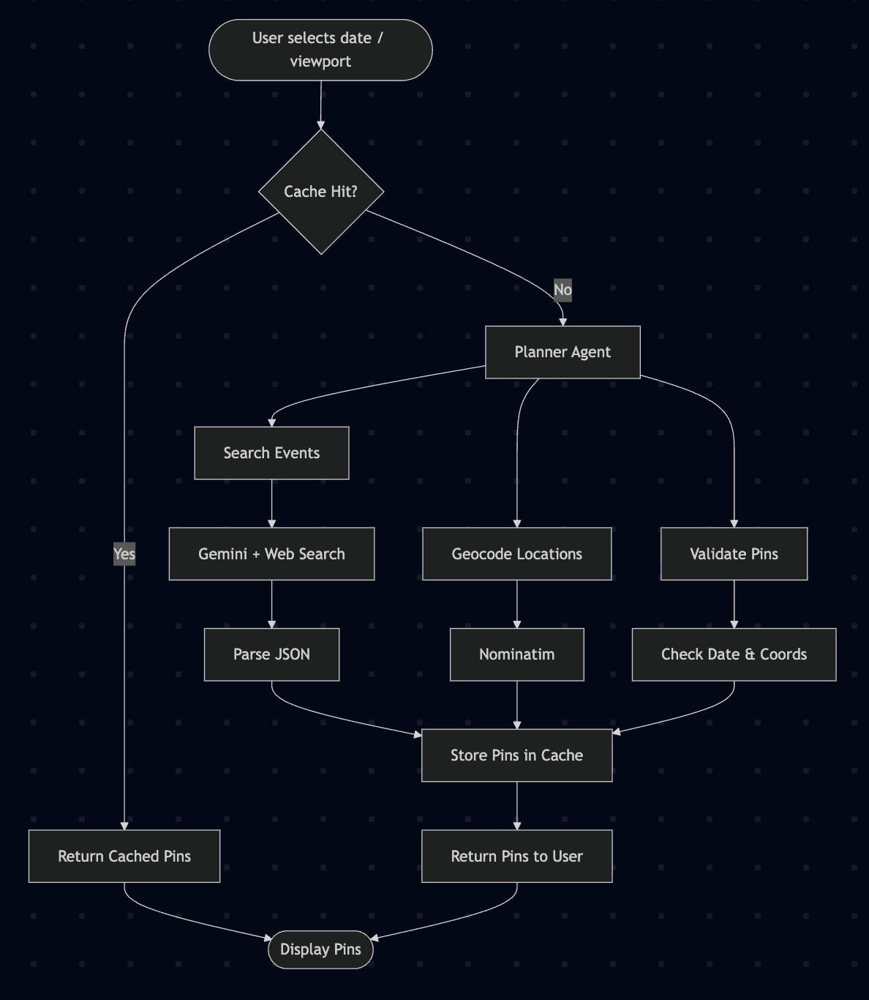
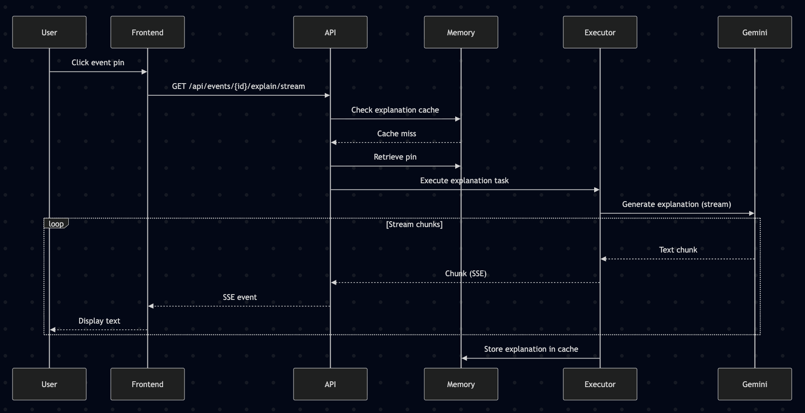

# Architecture Overview

Atlantis is an AI-powered world news and history map explorer built with a Planner-Executor-Memory agent architecture. The system uses Google Gemini API with web search capabilities to discover and display historical events and current news on an interactive map.

## System Architecture

Below is a high-level architecture diagram illustrating how Atlantis components interact.



**Key Components:**

- **Frontend (React + TypeScript):**  
  Provides the interactive map UI, date picker, language selector, and interfaces for receiving streaming explanations. Uses Mapbox GL for map rendering and communicates with the backend via REST and SSE (Server-Sent Events).

- **Backend (FastAPI):**  
  Handles API requests and acts as the agent orchestration core.

  - **Agent Core:** Implements the Planner-Executor-Memory agent pattern.
    - **Planner:** Decomposes user requests into task graphs.
    - **Executor:** Executes tasks using tools/services (e.g., Gemini API, geocoding).
    - **Memory:** Caches results to reduce redundant computation.

- **Services:**

  - **Gemini Service:** Wraps calls to Google Gemini API for web search and event extraction.
  - **Cache Service:** Provides fast memory retrieval for previously computed results (viewport/date/language specific).
  - **Geocoding Service:** Resolves location names via Nominatim (OpenStreetMap).

- **External APIs:**
  - **Google Gemini API:** Used to search and generate historical/news events.
  - **Nominatim OSM:** Used for geocoding (converting textual locations to lat/lng).

**Workflow Overview:**

1. User interacts with the map and selects a date range/view/language.
2. Frontend sends request to the backend API.
3. Agent checks memory (cache) for existing results.
4. If not cached, Planner breaks request into dependent tasks.
5. Executor runs tasks (search events via Gemini, geocode locations, validate pins).

## Agent Architecture

The system implements a Planner-Executor-Memory pattern for structured task execution:



Below is a high-level agent architecture diagram illustrating the Planner-Executor-Memory pattern.

**Agent Workflow:**

1. **Planner:**  
   Decomposes user intent (e.g., "Show events in Europe on Jan 1, 1914") into a series of dependent tasks, forming a Directed Acyclic Graph (DAG) of operations such as event search, geocoding, and validation.

2. **Executor:**  
   Executes tasks in the correct dependency order. Interacts with external tools/services:

   - Calls Gemini API for news/event generation
   - Performs geocoding using Nominatim
   - Validates results and normalizes output

3. **Memory:**  
   Caches intermediate and final results (e.g., pins for given date range and viewport) for efficient retrieval on repeat or similar queries. Supports both short-term (in-memory) and persistent storage for rapid user experience.

## Components

### 1. Frontend Layer

**Technology Stack:**

- React 18 with TypeScript
- Vite for build tooling
- Mapbox GL JS for map rendering
- Server-Sent Events (SSE) for streaming responses
- React Query for data fetching and caching

**Key Components:**

- `WorldMap.tsx`: Interactive map with event pins
- `EventDialog.tsx`: Event detail modal with explanations and Q&A
- `AtlantisBar.tsx`: Voice command interface and controls
- Custom hooks: `useSSE.ts`, `useEvents.ts` for API communication

**Features:**

- Real-time streaming of explanations and chat responses
- Multi-language support (English, Chinese, Spanish, French, etc.)
- Zoom-aware event filtering (local events when zoomed in, global when zoomed out)
- Date range selection for historical exploration

### 2. Backend API Layer

**Technology Stack:**

- FastAPI for REST API
- Python 3.10
- Uvicorn ASGI server
- Pydantic for data validation

**API Endpoints:**

- `POST /api/events/pins` - Generate event pins for date range and viewport
- `GET /api/events/{event_id}/explain/stream` - Stream event explanation (SSE)
- `POST /api/events/{event_id}/chat/stream` - Stream Q&A response (SSE)
- `POST /api/events/parse-command` - Parse voice command (extract location, dates, language)
- `GET /api/events/random-event` - Get random historic event
- `GET /api/events/{event_id}/live/ws` - WebSocket for live conversation
- `POST /api/events/ephemeral-token` - Create ephemeral token for Live API

### 3. Agent Core

The agent follows a Planner-Executor-Memory architecture:

#### Planner (`src/backend/services/agent/planner.py`)

Responsible for breaking down user goals into sub-tasks with dependencies.

**Key Methods:**

- `plan_pins_generation()`: Plans tasks for generating event pins
  - Task 1: `search_events` (Gemini operation)
  - Task 2: `geocode_locations` (depends on search_events)
  - Task 3: `validate_pins` (depends on geocode_locations)
- `plan_explanation()`: Plans explanation generation
- `plan_chat_response()`: Plans Q&A response generation
- `plan_command_parsing()`: Plans voice command parsing
- `plan_random_event()`: Plans random event generation

**Task Structure:**

```python
@dataclass
class Task:
    name: str
    tool: str  # "gemini", "geocoding", "validate", "format"
    params: Dict[str, Any]
    dependencies: List[str]  # Other task names that must complete first
```

#### Executor (`src/backend/services/agent/executor.py`)

Executes tasks by routing to appropriate tools and handling dependencies.

**Tool Routing:**

- `gemini`: Calls GeminiService for LLM operations
  - `generate_pins`: Event discovery with web search
  - `stream_explanation`: Generate event explanations
  - `stream_chat`: Q&A responses
  - `parse_command`: Extract entities from voice commands
  - `random_event`: Find random historic events
- `geocoding`: Calls GeocodingService for location → coordinates
- `validate`: Validates pin data (dates, coordinates)
- `format`: Data formatting operations

**Key Features:**

- Dependency resolution (ensures tasks execute in correct order)
- Parameter resolution from context (passing results between tasks)
- Error handling and retry logic

#### Memory (`src/backend/services/agent/memory.py`)

Unified memory management for cache, pins, and conversation history.

**Memory Stores:**

1. **Cache Service**: TTL-based in-memory cache

   - Pins cache: 1 hour TTL
   - Explanations cache: 12 hours TTL
   - Date range accumulation (merges pins across viewports)

2. **Pin Store**: In-memory storage of event pins by event_id

3. **Conversation History**: Session-based chat history for WebSocket connections

**Key Methods:**

- `store_cache()` / `retrieve_cache()`: Cache operations
- `store_pin()` / `retrieve_pin()`: Pin storage
- `store_conversation()` / `retrieve_conversation()`: Chat history
- `merge_and_set_date_range_pins()`: Accumulate pins for date ranges

### 4. Services Layer

#### GeminiService (`src/backend/services/gemini.py`)

Integration with Google Gemini API using `google-genai` SDK.

**Model:** `gemini-2.0-flash`

**Key Features:**

- Web search integration using Gemini's `GoogleSearch` tool
- Real-time event discovery from reliable sources
- Multi-language support
- Streaming responses for explanations and chat

**Operations:**

- `generate_pins()`: Uses web search to find real events, extracts locations, generates Pin objects
- `stream_explanation()`: Generates TLDR news article about an event
- `stream_chat()`: Answers questions about events with conversation context

**Web Search Integration:**

- Gemini API includes built-in Google Search tool
- System prompts instruct model to use web search for real-time, accurate information
- Results are validated for date ranges and location accuracy

#### CacheService (`src/backend/services/cache.py`)

In-memory TTL cache with expiration management.

**Cache Keys:**

- Pins: Based on date range, viewport (rounded bbox), zoom, language, max_pins
- Explanations: Based on event_id and language
- Date range pins: Accumulated pins for date ranges (merged across viewports)

**TTL Settings:**

- Pins: 1 hour
- Explanations: 12 hours

**Features:**

- Automatic expiration cleanup
- Cache key generation with MD5 hashing
- Date range accumulation (deduplicates by event_id)

#### GeocodingService (`src/backend/services/news.py`)

Location geocoding using Nominatim (OpenStreetMap).

**Features:**

- Free, no API key required
- Returns actual geographic coordinates (not viewport-biased)
- Prefers specific locations (places, buildings) over generic (cities, countries)
- Returns enhanced display names with address components

**Rate Limits:**

- Nominatim free tier: 1 request/second (with User-Agent)
- System uses rate limiting and caching to minimize requests

## Data Flow

### Pin Generation Flow



### Explanation Streaming Flow



## Tool Integrations

### Google Gemini API

**Integration Details:**

- SDK: `google-genai` (v0.2.0+)
- Model: `gemini-2.0-flash`
- API Version: v1 (standard)

**Features Used:**

- Text generation with temperature control
- Google Search tool for real-time information
- Streaming responses
- Function calling for structured outputs (JSON)

**Configuration:**

- Temperature: 0.2 for event generation, 0.6-0.7 for explanations/chat
- Max tokens: Dynamic based on max_pins (~600 tokens per pin)
- Response modalities: TEXT only

### Nominatim (OpenStreetMap) Geocoding

**Integration Details:**

- API: REST API (no authentication required)
- User-Agent: Required (set to "Atlantis-WorldNews/1.0")
- Rate Limit: 1 request/second (free tier)

**Usage:**

- Location name → lat/lng coordinates
- Returns enhanced display names with address components
- Prefers specific locations over generic ones

## Observability & Logging

### Logging Configuration

**Backend Logging:**

- Framework: Python `logging` module
- Level: INFO (configurable)
- Format: `%(asctime)s - %(name)s - %(levelname)s - %(message)s`
- Location: Configured in `src/backend/main.py`

**Logging Points:**

- API request/response logging (FastAPI automatic)
- Gemini API calls and errors
- Geocoding requests and failures
- Cache hits/misses
- Task execution and errors
- JSON parsing errors with context

**Example Log Messages:**

- `INFO: Generating pins for date range 2024-01-01 to 2024-01-07`
- `WARNING: Geocoding failed for location: {location}`
- `ERROR: JSON parse error in Gemini response`

### Testing

**Smoke Tests (`TEST.sh`):**

- Verifies all modules can be imported
- Checks for syntax errors
- Validates dependency installation
- Can run in CI/CD pipelines

**Test Coverage:**

- Module imports
- Basic functionality verification
- API key validation (warns but doesn't fail in CI)

## Deployment Architecture

### Development

- Backend: `uvicorn src.backend.main:app --reload` on port 8000
- Frontend: `npm run dev` (Vite) on port 5173
- Frontend proxies `/api/*` requests to backend

### Production (Docker)

**Multi-stage Build:**

1. Stage 1: Build frontend (Node.js 18)
   - Install dependencies
   - Build production bundle
2. Stage 2: Python backend
   - Install Python dependencies
   - Copy backend code
   - Copy built frontend static files
   - Run uvicorn server

**Environment Variables:**

**Backend:**

- `GEMINI_API_KEY`: Required for backend API calls (generating pins, explanations, chat)

**Frontend (build-time):**

- `VITE_MAPBOX_TOKEN`: Required for frontend build (Mapbox map rendering)
- `VITE_GEMINI_API_KEY`: Required for frontend build (Gemini Live API features)
- `PYTHONUNBUFFERED=1`: For proper logging

## Performance Considerations

### Caching Strategy

- **Pins Cache**: 1-hour TTL, keyed by date range + viewport + language
- **Explanations Cache**: 12-hour TTL, keyed by event_id + language
- **Date Range Accumulation**: Merges pins across different viewports for same date range

### API Rate Limits

- **Gemini API**: Subject to quota limits (varies by plan)
- **Nominatim**: 1 request/second (free tier)
- System implements caching to minimize external API calls

### Scalability

**Current Limitations:**

- In-memory cache (not shared across instances)
- Pin storage in memory (not database-backed)
- Single-server deployment

**Production Recommendations:**

- Use Redis for shared cache
- Database for persistent pin storage
- Load balancer for multiple backend instances
- CDN for static frontend assets
